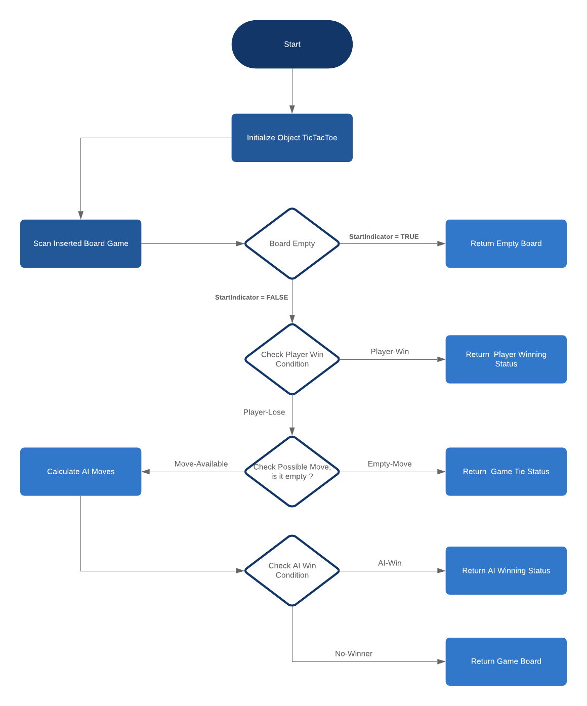
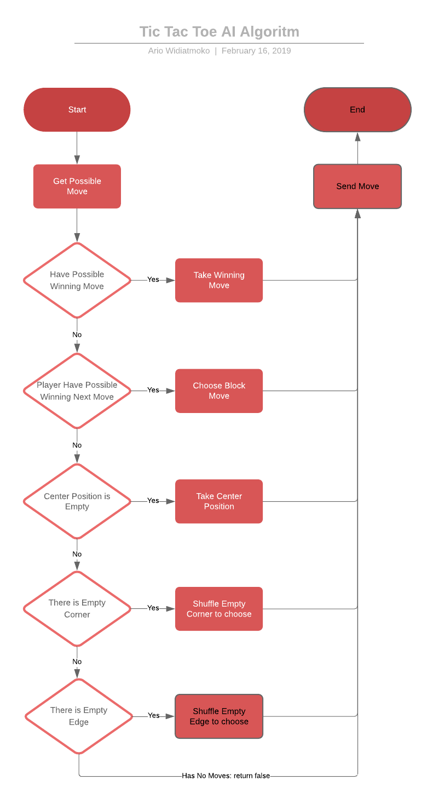

# php_tictactoe

Tic Tac Toe Game Using PHP. nb: and a little JavaScrpit. ;)
Please serve this project in local server if you want this to work.

## License & Disclaimer

Free for all. Please note that I am following tutorial from [Tech with Tim!](https://techwithtim.net/tutorials/python-programming/tic-tac-toe-tutorial/) Tic Tac Toe Tutorial with Python, and modified it to suite PHP and made a little change with the algorithm to make not losing (I Think ?).

## Game Flowchart

## AI Flowchart

